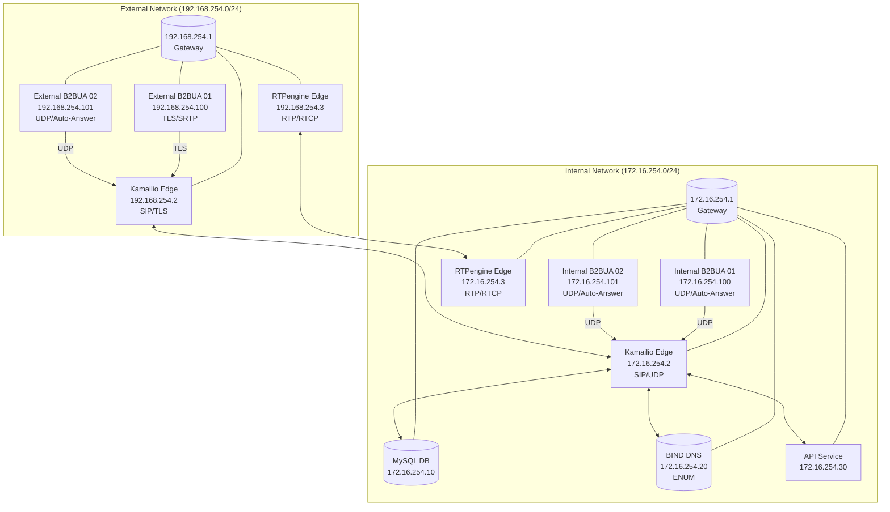

```mermaid
graph TD
    subgraph "External Network (192.168.254.0/24)"
        direction TB
        ExtNet[(192.168.254.1<br/>Gateway)]
        
        ExtB2BUA1[External B2BUA 01<br/>192.168.254.100<br/>TLS/SRTP]
        ExtB2BUA2[External B2BUA 02<br/>192.168.254.101<br/>UDP/Auto-Answer]
        
        ExtKamailio[Kamailio Edge<br/>192.168.254.2<br/>SIP/TLS]
        ExtRTPengine[RTPengine Edge<br/>192.168.254.3<br/>RTP/RTCP]
    end

    subgraph "Internal Network (172.16.254.0/24)"
        direction TB
        IntNet[(172.16.254.1<br/>Gateway)]
        
        IntB2BUA1[Internal B2BUA 01<br/>172.16.254.100<br/>UDP/Auto-Answer]
        IntB2BUA2[Internal B2BUA 02<br/>172.16.254.101<br/>UDP/Auto-Answer]
        
        IntKamailio[Kamailio Edge<br/>172.16.254.2<br/>SIP/UDP]
        IntRTPengine[RTPengine Edge<br/>172.16.254.3<br/>RTP/RTCP]
        
        DB[(MySQL DB<br/>172.16.254.10)]
        DNS[(BIND DNS<br/>172.16.254.20<br/>ENUM)]
        API[API Service<br/>172.16.254.30]
    end

    %% Connections within External Network
    ExtNet --- ExtB2BUA1
    ExtNet --- ExtB2BUA2
    ExtNet --- ExtKamailio
    ExtNet --- ExtRTPengine
    
    ExtB2BUA1 --TLS--> ExtKamailio
    ExtB2BUA2 --UDP--> ExtKamailio

    %% Connections within Internal Network
    IntNet --- IntB2BUA1
    IntNet --- IntB2BUA2
    IntNet --- IntKamailio
    IntNet --- IntRTPengine
    IntNet --- DB
    IntNet --- DNS
    IntNet --- API
    
    IntB2BUA1 --UDP--> IntKamailio
    IntB2BUA2 --UDP--> IntKamailio
    
    %% Cross-network connections (Kamailio & RTPengine bridging)
    ExtKamailio <---> IntKamailio
    ExtRTPengine <---> IntRTPengine
    
    %% Internal services connections
    IntKamailio <---> DB
    IntKamailio <---> DNS
    IntKamailio <---> API
```